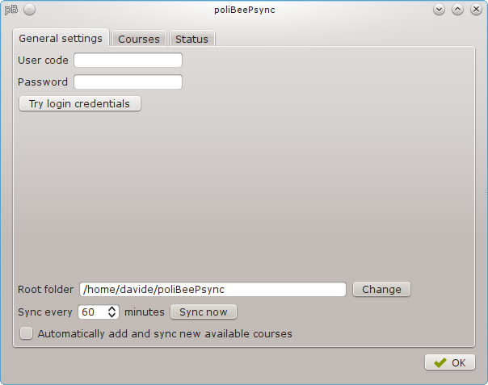
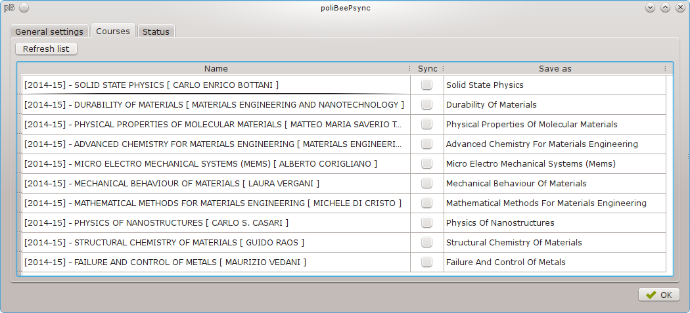

What is poliBeePsync?
=====================

.. toctree::
  :maxdepth: 3
  :hidden:

  installation
  quickstart
  developing

PoliBeePsync is a simple GUI program, aimed at students of Politecnico di
Milano, which purpose is to sync the files loaded by professors onto the
`BeeP platform <https://beep.metid.polimi.it>`_.

This software is in the beta stage and the documentation is under
construction.

Support
=======

Nothing happens, what should I do?
-----------------------------------

First of all, check the ``Status`` tab. This tab is used to show various messages,
errors included.

If you get ``I can't connect to the server. Is the Internet connection working?``,
or ``The timeout time has been reached. Is the Internet connection working?``,
as the messages say, the program couldn't connect to the BeeP website. Check if
your Internet connection is working. Then you could try ``sync now`` and see if
the problem persists.

If you get ``Login failed.``:

* Check if the **User code** is correct
* Check if the **Password** is correct
* Check if the **Password is not expired**
* Check if the **account is not blocked**

If you still have problems, use the debug mode as described
in the :doc:`debug` page.

If you still have problems, or other errors come up,
feel free to send an e-mail to dcdrj.pub AT gmail DOT com or contact me on Wire/Telegram @jacotsu

License
========

PoliBeePsync is distributed under the GNU General Public License v3 or later
(GPLv3+). The full license text is available `here <http://www.gnu.org/copyleft/gpl.html>`_.
