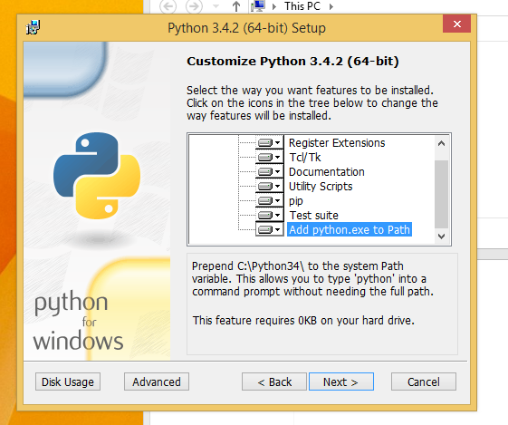
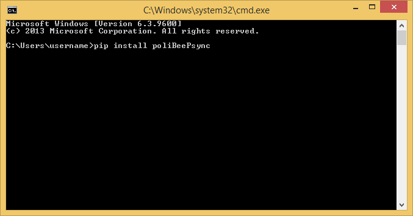
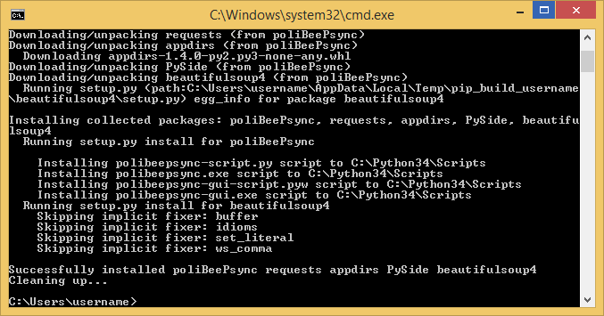
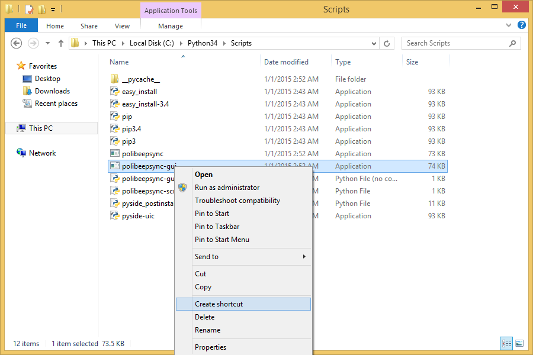

Installing, Upgrading or Removing
=================================
The program hasn't been tested on Mac OS X yet.

Installation (Linux)
----------------------

.. note:: Every distribution uses slightly different names for the
    ``python`` command. I'll show commands for Ubuntu 19.04.

Install python 3.7 using the package manager of your distribution.

You also need ``pip`` and other programs (to compile the library ``PySide``)
Install the following dependencies

.. code-block:: bash

    sudo apt update
    sudo apt install python3.7 python3-pip build-essential cmake libqt4-dev

You have two choices now: install poliBeePsync directly or in a "virtual
environment", which is a fancy name for a folder holding a copy of python,
under which poliBeePsync will be installed. This implies that you can easily
remove the application by just removing the folder of the virtual environment.

I recommend using a virtual environment, although it's slightly more
difficult.

Direct installation
^^^^^^^^^^^^^^^^^^^^^^
In a terminal issue the command

.. code-block:: bash

    pip3 install --user poliBeePsync

Once it has finished, you can start the application with the command
``polibeepsync-gui``.

I recommend adding a custom menu entry to the application menu of your
Desktop Environment.
As an icon, you can use `this one <https://github.com/Jacotsu/polibeepsync/blob/master/icons/polibeepsync.svg>`_.

Installation inside a virtual environment
^^^^^^^^^^^^^^^^^^^^^^^^^^^^^^^^^^^^^^^^^^

1. Create a virtual environment.
    Open a terminal and type
    ::

      sudo pip3 install virtualenv
      virtualenv polibeepsync-venv
      source polibeepsync-venv/bin/activate

    You can choose the name of folder, I chose ``polibeepsync-venv``.

2. Install the program.
    Open a terminal and write
    ::

        pip3 install poliBeePsync

    Press ``Enter`` to confirm and wait.

Once it has finished, you can start the application with the command
``polibeepsync-gui`` if the virtual environment is active (this is done with
the third command shown in point 1).

You can automate this by creating a shell script with the following content

.. code-block:: bash

    cd ~/polibeepsync-venv
    source bin/activate
    polibeepsync-gui &

I recommend adding a custom menu entry to the application menu of your
Desktop Environment.
As an icon, you can use `this one <https://github.com/Jacotsu/polibeepsync/blob/master/icons/polibeepsync.svg>`_.
In this case, you would create an entry for the shell script.

Upgrade
^^^^^^^^

If you installed poliBeePsync directly, open a terminal, write the following
code and press ``Enter``

.. code-block:: bash

    pip3 install --upgrade poliBeePsync

If you used a virtual environment, before issuing the command, remember to
activate the virtual environment

.. code-block:: bash

    cd ~/polibeepsync-venv
    source bin/activate

How to remove
^^^^^^^^^^^^^

Uninstall poliBeePsync by writing this code in a terminal

.. code-block:: bash

    pip3 uninstall poliBeePsync

When it asks for confirmation, type ``y`` and press ``Enter`` again.

Removing leftover data
^^^^^^^^^^^^^^^^^^^^^^^
Remove ``~/.config/poliBeePsync`` and ``~/.local/share/poliBeePsync``

.. code-block:: bash

    rm -r ~/.config/poliBeePsync
    rm -r ~/.local/share/poliBeePsync

Installation (Windows)
-----------------------

Install `python 3.7 <https://www.python.org/>`_, making sure to enable the
option "Add python.exe to Path".

Open the program ``cmd.exe``, then write

.. code-block:: bash

    pip3 install poliBeePsync

...and press ``Enter`` (if you get an error telling that ``pip`` is not a recognized command,
logout and re-login, then write the command). Words will appear, wait. Once it says it has finished,
look where it has been installed.

In the image, you can see that it has been installed to ``C:\Python37\Scripts``.
Browse to that folder, right click on ``polibeepsync-gui.exe`` and
choose ``create shortcut``.

Now you can copy the shortcut wherever you want and use it to start the
program.

You may want to add a `nicer icon <https://raw.githubusercontent.com/jacotsu/polibeepsync/master/icons/uglytheme/48x48/polibeepsync.ico>`_
to the shortcut, by right-clicking on the shortcut, choosing ``Properties``
and then clicking on ``Choose icon``.

Start the application automatically at boot (Windows)
^^^^^^^^^^^^^^^^^^^^^^^^^^^^^^^^^^^^^^^^^^^^^^^^^^^^^

Right click on the shortcut and select ``copy``.
Open the ``run`` program (you can find it by typing ``run`` after pressing
the "Windows" key), write

.. code-block:: bash

	%AppData%

and then click ``Ok``. In the opened folder, go to ``Microsoft\Windows\Start Menu\Programs\Startup``
and choose ``paste shortcut``. The next time you boot, the program will
start automatically.

Upgrade
^^^^^^^

Open the program ``cmd.exe``, Write the following and press ``Enter``

.. code-block:: bash

    pip3 install --upgrade poliBeePsync

How to remove
^^^^^^^^^^^^^

Open ``cmd.exe``

.. code-block:: bash

    pip3 uninstall poliBeePsync

...and then press ``Enter`` to execute the command. When it asks for
confirmation, type ``y`` and press ``Enter``

Removing leftover data
^^^^^^^^^^^^^^^^^^^^^^^
The next step is removing the folders in which settings and data are saved.
Open your user folder, make hidden files and folders visible, open
``AppData\Local`` and remove the folder named ``poliBeePsync``.
