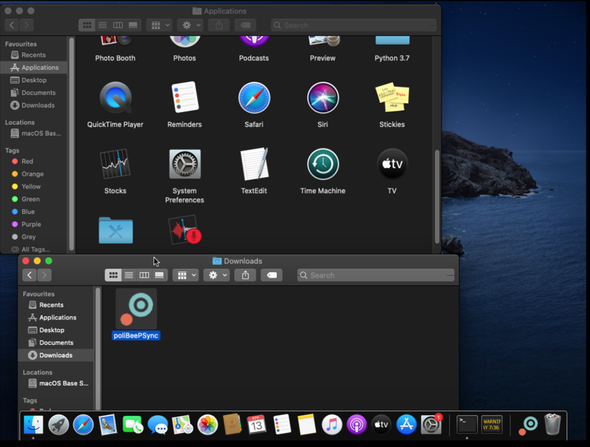
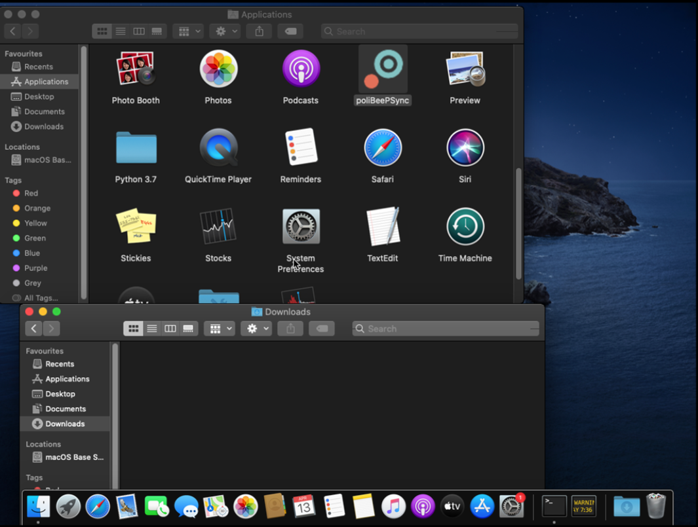
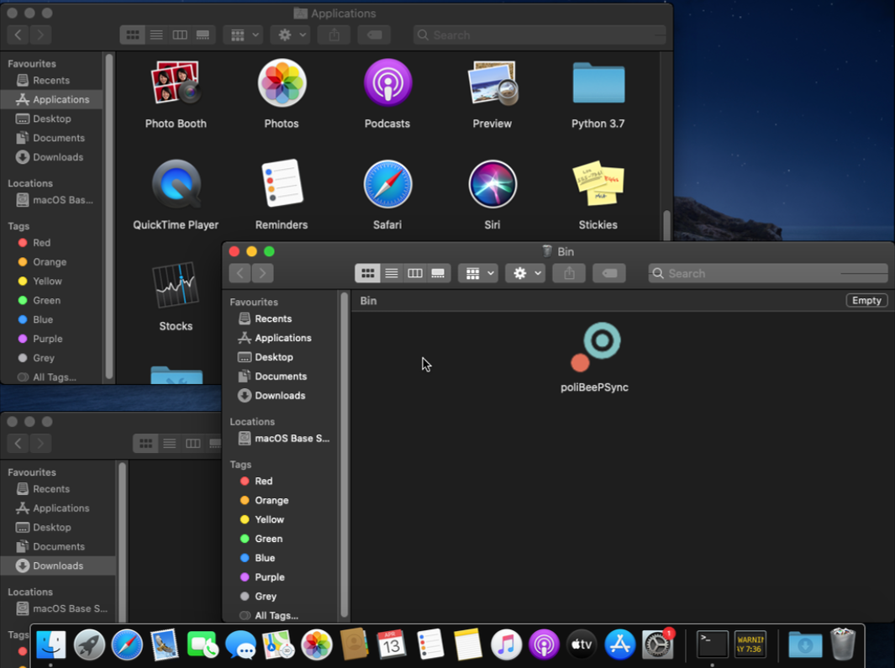

Installing, Upgrading or Removing
=================================

Linux
------
For removal and upgrading consult your package manager manual

Ubuntu 19.10
^^^^^^^^^^^^
.. code-block:: bash

  sudo add-apt-repository ppa:jacotsu/polibeepsync
  sudo apt update
  sudo apt install python3-polibeepsync

Arch
^^^^
.. code-block:: bash

  yay -S polibeepsync

Upgrading
^^^^^^^^^

If you installed poliBeePsync directly, open a terminal, write the following
code and press ``Enter``

.. code-block:: bash

    pip3 install --upgrade poliBeePsync

If you used a virtual environment, before issuing the command, remember to
activate the virtual environment

.. code-block:: bash

    cd ~/polibeepsync-venv
    source bin/activate

Removing
^^^^^^^^^^^^^

Uninstall poliBeePsync by writing this code in a terminal

.. code-block:: bash

    pip3 uninstall poliBeePsync

When it asks for confirmation, type ``y`` and press ``Enter`` again.

Removing leftover data
^^^^^^^^^^^^^^^^^^^^^^^
Remove ``~/.config/poliBeePsync`` and ``~/.local/share/poliBeePsync``

.. code-block:: bash

    rm -r ~/.config/poliBeePsync
    rm -r ~/.local/share/poliBeePsync

Windows
--------
Upgrading or installing
^^^^^^^^^^^^^^^^^^^^^^^
Download the exe file from the `latest release <https://github.com/Jacotsu/polibeepsync/releases/latest>`_
open the downloaded file and follow the installer instructions.

Removing
^^^^^^^^^^^^^

Start > Search > polibeepsync > right click > uninstall

Removing leftover data
^^^^^^^^^^^^^^^^^^^^^^^
The next step is removing the folders in which settings and data are saved.
Open your user folder, make hidden files and folders visible, open
``AppData\Local`` and remove the folder named ``poliBeePsync``.

Start the application automatically at boot (Windows)
^^^^^^^^^^^^^^^^^^^^^^^^^^^^^^^^^^^^^^^^^^^^^^^^^^^^^

Right click on the shortcut and select ``copy``.
Open the ``run`` program (you can find it by typing ``run`` after pressing
the "Windows" key), write

.. code-block:: bash

	%AppData%

and then click ``Ok``. In the opened folder, go to ``Microsoft\Windows\Start Menu\Programs\Startup``
and choose ``paste shortcut``. The next time you boot, the program will
start automatically.

Mac Os
-------
The App has been tested and built for Mac Os Catalina, if the app doesn't work
try to install it through the direct method.

Installing
^^^^^^^^^^^^
Download the .app.zip file from the `latest release <https://github.com/Jacotsu/polibeepsync/releases/latest>`_ and then
drag it from the Downloads to Applications.

Removing
^^^^^^^^
Drag the app file from the Applications directory to the bin

Removing leftover data
^^^^^^^^^^^^^^^^^^^^^^^
Delete the following folder:

- `/Users/$YOUR_USERNAME/Library/Application Support/poliBeePsync`

Direct installation
-------------------
.. warning::
  Only use the direct installation if you want to hack on polibeepsync or be on the bleeding edge

In a terminal issue the command

.. code-block:: bash

    pip3 install --user poliBeePsync

Once it has finished, you can start the application with the command
``polibeepsync-gui``.

Installation inside a virtual environment
-----------------------------------------
.. warning::
  Only use the virtual env installation if you want to hack on polibeepsync or be on the bleeding edge

1. Create a virtual environment.
    Open a terminal and type
    ::

      sudo pip3 install virtualenv
      virtualenv polibeepsync-venv
      source polibeepsync-venv/bin/activate

    You can choose the name of folder, I chose ``polibeepsync-venv``.

2. Install the program.
    Open a terminal and write
    ::

        pip3 install poliBeePsync

    Press ``Enter`` to confirm and wait.

Once it has finished, you can start the application with the command
``polibeepsync-gui`` if the virtual environment is active (this is done with
the third command shown in point 1).

You can automate this by creating a shell script with the following content

.. code-block:: bash

    cd ~/polibeepsync-venv
    source bin/activate
    polibeepsync-gui &

I recommend adding a custom menu entry to the application menu of your
Desktop Environment.
As an icon, you can use `this one <https://github.com/Jacotsu/polibeepsync/blob/master/icons/polibeepsync.svg>`_.
In this case, you would create an entry for the shell script.

