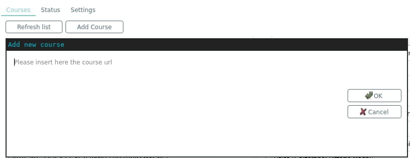

.. toctree::
  :maxdepth: 1

User interface guide
====================

Courses tab
-----------

Adding missing/arbitrary courses
^^^^^^^^^^^^^^^^^^^^^^^^^^^^^^^^

Some courses (such as `Computer Security`) are not automatically recognized by poliBeePsync because they have
non standard names, or maybe you're interested in downloading some material from a course that you're not subscribed
to.

Since version `0.8.0` it's possible to add any course to the courses tab through the `Add Course` button.

.. warning::
  Some courses have files viewable only by subscribed users, this won't let download any file if you're not
  actually subscribed to that course on BeeP.

Just open the course page in the browser, copy the URL, paste it in the popup and click ok.
If everything went well you should see the following message `Added course from $URL`
